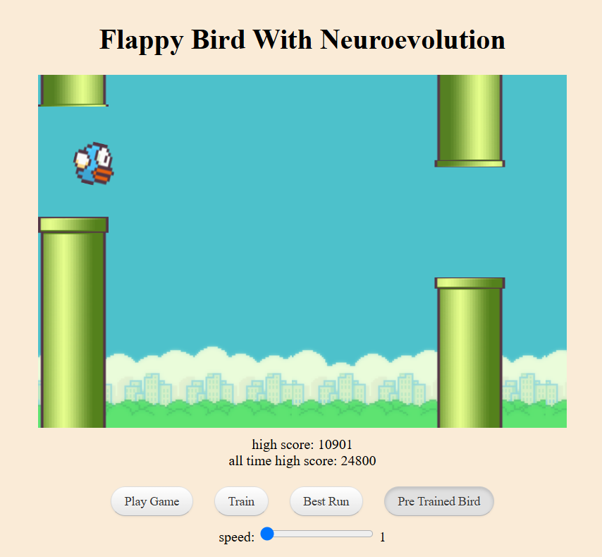

# Flappy Bird With Neuroevolution

A fun and interactive implementation of the classic Flappy Bird game enhanced with neuroevolution. This project uses p5.js for rendering and custom neural network and genetic algorithm code to evolve AI-controlled birds that learn to play the game.

## Features

- **Multiple Game Modes**

  - **Play Game:** Manually control the bird.
  - **Train:** Run a genetic algorithm to evolve a population of birds.
  - **Best Run:** Watch the best-performing bird.
  - **Pre Trained Bird:** Use a pre-trained neural network to play.

- **Neuroevolution**

  - Custom neural network implementation with matrix operations.
  - Genetic algorithm for evolving bird populations through selection and mutation.

- **p5.js Integration**
  - Smooth graphics and responsive gameplay with p5.js.

## Demo



## Getting Started

### Prerequisites

- A modern web browser (Chrome, Firefox, Edge, etc.)
- (Optional) A local web server (e.g., [http-server](https://www.npmjs.com/package/http-server)) for testing the project locally.

### Installation

1. **Clone the Repository:**

   ```bash
   git clone https://github.com/MrHardik-k/neuroevolution-flappy-bird.git
   cd neuroevolution-flappy-bird
   ```

2. **Run the Project:**

   - Open `index.html` directly in your browser.
   - Or, use a local web server. For example, if you have Node.js installed:

     ```bash
     npx http-server
     ```

     Then navigate to the provided URL (usually [http://localhost:8080](http://localhost:8080)).

## Project Structure

- **index.html:** Main HTML file loading the necessary libraries and scripts.
- **index.js:** Main game logic and p5.js setup/draw functions.
- **bird.js:** Contains the `Bird` class and behavior logic.
- **pipe.js:** Contains the `Pipe` class for generating obstacles.
- **ga.js:** Genetic algorithm functions for evolving birds.
- **matrix.js & Mnn.js:** Libraries for matrix operations and neural network functionalities.
- **best_brain.json:** Pre-trained neural network configuration (if available).

## How to Play

1. **Select a Game Mode:**  
   Use the radio buttons to choose your desired mode: Play Game, Train, Best Run, or Pre Trained Bird.

2. **Control the Bird:**

   - In **Play Game** mode, click or press the spacebar to make the bird jump.
   - In **Train** mode, watch the birds evolve automatically through neuroevolution.

3. **Adjust Simulation Speed:**  
   Use the speed slider (if visible) to control the simulation speed.

4. **Monitor Scores:**  
   The current high score and all-time high score are displayed on-screen.

## Contributing

Contributions are welcome! Please fork the repository and submit pull requests. Follow the standard GitHub workflow for contributions.

## License

This project is licensed under the [MIT License](LICENSE).

## Acknowledgments

- [p5.js](https://p5js.org/) for the creative coding framework.
- Open-source communities behind neural network and genetic algorithm implementations.
- Inspiration from the original Flappy Bird game.
